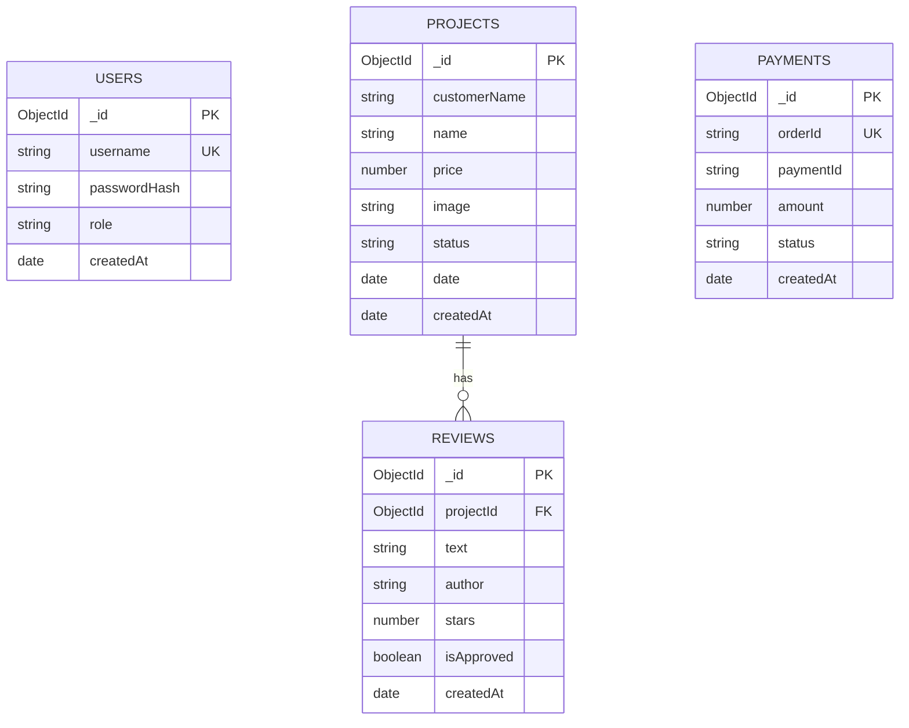

# ZER0ONE — FRONTEND AUDIT & BACKEND REQUIREMENTS BLUEPRINT

## 1. PROJECT OVERVIEW
- **Project Name**: ZER0ONE
- **Type**: Premium Digital Agency Web Application
- **Frontend Tech Stack**: Next.js 16.3.3 (Turbopack), React 19, TypeScript, Vanilla CSS / Utility styling, `xlsx` (SheetJS), `jspdf`.
- **Target Backend Tech Stack**: Node.js, Express.js, MongoDB Atlas (Mongoose), JWT, bcryptjs, Nodemailer, CORS, Helmet, Express Rate Limit.
- **Current Architecture**: Single-page view router (`src/app/page.tsx`) with dynamic mode switching (`CustomerMode` vs `AdminMode`). State is currently mocked and persisted using `localStorage` (`zeroone_projects`, `zeroone_reviews`) and `sessionStorage` (`hasSeenIntro`).

---

## 2. FRONTEND STRUCTURE AUDIT

### 2.1 File Map & Directory Tree
```text
src/
└── app/
    ├── components/
    │   ├── AdminMode.css
    │   ├── AdminMode.tsx        # Admin authentication, project CRUD, stats, Excel import/export, PDF receipt
    │   ├── CustomerMode.css
    │   ├── CustomerMode.tsx     # Client showcase, review tags, review submission, Razorpay payment modal
    │   ├── IntroAnimation.css
    │   └── IntroAnimation.tsx   # Video intro playback controller (/animation.mp4)
    ├── favicon.ico
    ├── globals.css
    ├── layout.tsx
    ├── page.css
    └── page.tsx                 # Root layout controller with secret admin toggle trigger
```

### 2.2 Core State & Persistence Mechanisms
1. **`sessionStorage.getItem('hasSeenIntro')`**: Prevents repeating the intro animation within the same browser session.
2. **`localStorage.getItem('zeroone_projects')`**: Stores custom projects added/edited via Admin mode or imported via Excel.
3. **`localStorage.getItem('zeroone_reviews')`**: Stores user-submitted reviews attached to specific projects.

---

## 3. PAGE-BY-PAGE & COMPONENT AUDIT

| Route / Component | Purpose | Interactive Elements | Current Behavior | Backend Requirement |
| :--- | :--- | :--- | :--- | :--- |
| `src/app/page.tsx` | App shell & view switcher | Secret Admin Toggle (`.admin-toggle-secret`) | Switches view state between `customer` and `admin` | Frontend-only UI state |
| `IntroAnimation.tsx` | Intro branding video | Video playback | Plays `/animation.mp4` & sets `sessionStorage` | Frontend-only |
| `CustomerMode.tsx` | Client Showcase | 1. Project Grid<br>2. "Cloth Tag" Reviews<br>3. Write Review Modal<br>4. Pay Us Modal | 1. Reads `localStorage`<br>2. Filtered reviews<br>3. Saves review to `localStorage`<br>4. Mock Razorpay alert | **Backend Needed**:<br>- `GET /api/v1/projects`<br>- `GET /api/v1/reviews`<br>- `POST /api/v1/reviews`<br>- `POST /api/v1/payments/create-order` |
| `AdminMode.tsx` | Administration Portal | 1. Admin Login Form<br>2. Metrics Cards<br>3. Add/Edit Project Form<br>4. Data Table<br>5. Excel Import/Export<br>6. PDF Receipt Download | 1. Hardcoded string check (`admin` / `zeroone2026`)<br>2. Derived from local array<br>3. Local state update<br>4. Inline actions<br>5. `xlsx` client processing<br>6. `jspdf` canvas creation | **Backend Needed**:<br>- `POST /api/v1/auth/login`<br>- `GET /api/v1/admin/metrics`<br>- `POST /api/v1/projects`<br>- `PUT /api/v1/projects/:id`<br>- `DELETE /api/v1/projects/:id`<br>- Optional Batch API |

---

## 4. ALL FORMS AUDIT

### 1. Admin Login Form
- **Location**: `AdminMode.tsx` (Unauthenticated state)
- **Fields**: 
  - `username` (Text, Required)
  - `password` (Password, Required)
- **Current Validation**: Client-side strict equality check `username === "admin" && password === "zeroone2026"`.
- **Target Backend API**: `POST /api/v1/auth/login`
- **MongoDB Collection**: `users`
- **Security & Response**: Verifies hashed password with `bcryptjs`, returns HTTP-only JWT cookie or bearer token.

### 2. Review Submission Form
- **Location**: `CustomerMode.tsx` (Modal overlay)
- **Fields**: 
  - `selectedProject` (ObjectId/Number, Hidden)
  - `reviewStars` (Number 1-5, Required)
  - `reviewText` (Textarea, Required)
- **Current Validation**: `reviewText.trim()` check.
- **Target Backend API**: `POST /api/v1/reviews`
- **MongoDB Collection**: `reviews`
- **Response**: `{ success: true, data: { review } }`

### 3. Razorpay Payment Form
- **Location**: `CustomerMode.tsx` (Payment Modal)
- **Fields**:
  - `paymentAmount` (Number, Required, min=1)
- **Current Validation**: Simple `!paymentAmount` check.
- **Target Backend API**: 
  - `POST /api/v1/payments/create-order` (Generates Razorpay `order_id`)
  - `POST /api/v1/payments/verify` (Validates cryptographic signature)
- **MongoDB Collection**: `payments`

### 4. Add / Edit Project Form
- **Location**: `AdminMode.tsx` (Employee Data Management)
- **Fields**:
  - `customerName` (Text, Required)
  - `name` (Text, Required)
  - `newImageUrl` (URL string, Optional)
  - `price` (Number, Required)
  - `status` (Select: "Pending" | "Delivered", Default: "Pending")
  - `date` (Date string, Required)
- **Current Validation**: HTML5 required attributes.
- **Target Backend API**: `POST /api/v1/projects` (Create) / `PUT /api/v1/projects/:id` (Update)
- **MongoDB Collection**: `projects`

---

## 5. DATABASE COLLECTIONS (MongoDB / Mongoose Architecture)



### 1. `users` Collection
- `_id`: ObjectId
- `username`: String (Required, Unique, Trimmed)
- `passwordHash`: String (Required)
- `role`: String (Enum: `['admin']`, Default: `'admin'`)
- `createdAt`: Date (Default: `Date.now`)

### 2. `projects` Collection
- `_id`: ObjectId
- `customerName`: String (Required, Trimmed)
- `name`: String (Required, Trimmed)
- `price`: Number (Required, Min: 0)
- `image`: String (Optional URL)
- `status`: String (Enum: `['Pending', 'Delivered']`, Default: `'Pending'`)
- `date`: Date (Required)
- `createdAt`: Date (Default: `Date.now`)

### 3. `reviews` Collection
- `_id`: ObjectId
- `projectId`: ObjectId (Ref: `Project`, Required, Indexed)
- `text`: String (Required, Max length 500)
- `author`: String (Default: `'Guest User'`)
- `stars`: Number (Required, Min: 1, Max: 5, Default: 5)
- `isApproved`: Boolean (Default: `true`)
- `createdAt`: Date (Default: `Date.now`)

### 4. `payments` Collection
- `_id`: ObjectId
- `orderId`: String (Required, Unique)
- `paymentId`: String (Optional)
- `amount`: Number (Required)
- `currency`: String (Default: `'INR'`)
- `status`: String (Enum: `['Created', 'Paid', 'Failed']`, Default: `'Created'`)
- `createdAt`: Date (Default: `Date.now`)

---

## 6. REST API BLUEPRINT

### Authentication Endpoints
- **`POST /api/v1/auth/login`**
  - **Auth**: Public
  - **Body**: `{ "username": "admin", "password": "..." }`
  - **Success Response**: `{ "success": true, "token": "JWT_TOKEN_HERE" }`
  - **Errors**: `400 Bad Request`, `401 Unauthorized`

- **`GET /api/v1/auth/me`**
  - **Auth**: Required (Admin JWT)
  - **Success Response**: `{ "success": true, "user": { "username": "admin", "role": "admin" } }`

### Project Management Endpoints
- **`GET /api/v1/projects`**
  - **Auth**: Public
  - **Success Response**: `{ "success": true, "count": 3, "data": [ ...projects ] }`

- **`POST /api/v1/projects`**
  - **Auth**: Required (Admin JWT)
  - **Body**: `{ "customerName": "...", "name": "...", "price": 180000, "status": "Pending", "date": "2026-08-25" }`
  - **Success Response**: `{ "success": true, "data": { ...newProject } }`

- **`PUT /api/v1/projects/:id`**
  - **Auth**: Required (Admin JWT)
  - **Body**: Partial project updates.

- **`DELETE /api/v1/projects/:id`**
  - **Auth**: Required (Admin JWT)
  - **Success Response**: `{ "success": true, "message": "Project deleted successfully" }`

### Review Endpoints
- **`GET /api/v1/reviews`**
  - **Auth**: Public
  - **Query Params**: `?projectId=...` (Optional filter)
  - **Success Response**: `{ "success": true, "data": [ ...reviews ] }`

- **`POST /api/v1/reviews`**
  - **Auth**: Public (Rate limited)
  - **Body**: `{ "projectId": "...", "text": "Great platform!", "stars": 5 }`
  - **Success Response**: `{ "success": true, "data": { ...newReview } }`

### Payment Endpoints
- **`POST /api/v1/payments/create-order`**
  - **Auth**: Public
  - **Body**: `{ "amount": 5000 }`
  - **Success Response**: `{ "success": true, "orderId": "order_xyz123" }`

- **`POST /api/v1/payments/verify`**
  - **Auth**: Public
  - **Body**: `{ "razorpay_order_id": "...", "razorpay_payment_id": "...", "razorpay_signature": "..." }`
  - **Success Response**: `{ "success": true, "message": "Payment verified successfully" }`

### Admin Dashboard Endpoints
- **`GET /api/v1/admin/metrics`**
  - **Auth**: Required (Admin JWT)
  - **Success Response**: `{ "success": true, "metrics": { "totalCustomers": 10, "totalSales": 5, "pendingItems": 2, "totalRevenue": 1250000 } }`

---

## 7. SECURITY & PROTECTION AUDIT
1. **Password Security**: Use `bcryptjs` with salt rounds = 10 for storing admin password hash.
2. **JWT Security**: Sign JWT with high entropy `JWT_SECRET`, enforce expiration (e.g. 24h), send via HTTP-Only SameSite cookies or Authorization header.
3. **Rate Limiting**:
   - `/api/v1/auth/login`: Strict limit (5 requests per 15 minutes per IP).
   - `/api/v1/reviews`: Spam limit (10 submissions per hour per IP).
   - General API: 100 requests per 15 minutes per IP.
4. **Input Sanitization**: Validate all inputs using schema validation (Express Validator / Zod) to prevent NoSQL injection and XSS attacks.
5. **CORS Headers**: Restrict allowed origin strictly to `CLIENT_URL` (e.g., `http://localhost:3000` or production domain).

---

## 8. FRONTEND CHANGES REQUIRED (FUTURE PHASE)

> [!NOTE]
> NO frontend files were modified during this audit phase.

When implementing the backend integration:
1. **`CustomerMode.tsx`**: Replace `localStorage` loading logic in `useEffect` with `axios` or native `fetch` requests to `GET /api/v1/projects` and `GET /api/v1/reviews`.
2. **Review Modal (`CustomerMode.tsx`)**: Replace `setReviews([...reviews, newReview])` with `POST /api/v1/reviews`.
3. **Admin Login (`AdminMode.tsx`)**: Replace static string comparison with `POST /api/v1/auth/login` and store auth token.
4. **Project Management (`AdminMode.tsx`)**: Connect Add, Edit, and Delete actions to corresponding REST API endpoints (`POST`, `PUT`, `DELETE /api/v1/projects`).

---

## 9. DEPLOYMENT ARCHITECTURE

```text
       [ Next.js Frontend ] (Vercel)
                │
                │  HTTPS REST API Requests
                ▼
       [ Express.js Backend ] (Render / Railway / DigitalOcean)
                │
                │  Mongoose Connection String
                ▼
      [ MongoDB Atlas Database ]
```

---

## 10. ZER0ONE BACKEND BUILD ORDER

1. **Phase 1: Environment Setup & Core Server Bootstrap** *(Already Completed)*
2. **Phase 2: Database Connection & Schemas (`models/`)**
   - Create `User.js`, `Project.js`, `Review.js`, and `Payment.js` Mongoose models.
3. **Phase 3: Admin Authentication Subsystem**
   - Seed initial Admin user script.
   - Implement `POST /api/v1/auth/login` with `bcryptjs` and `jsonwebtoken`.
   - Implement auth middleware `protectAdmin.js`.
4. **Phase 4: Project Management API (`controllers/projects.js` & `routes/projects.js`)**
   - Implement `GET /api/v1/projects` (Public).
   - Implement `POST`, `PUT`, `DELETE /api/v1/projects` (Protected Admin).
5. **Phase 5: Reviews Subsystem (`controllers/reviews.js` & `routes/reviews.js`)**
   - Implement `GET /api/v1/reviews` and `POST /api/v1/reviews` with rate limiting.
6. **Phase 6: Admin Metrics Endpoint (`controllers/admin.js`)**
   - Implement aggregated DB query for live revenue and sales stats.
7. **Phase 7: Razorpay Payment Gateway Integration**
   - Implement order creation and signature verification endpoints.
8. **Phase 8: Frontend ↔ Backend Wiring**
   - Update frontend API calls (in a separate task).
